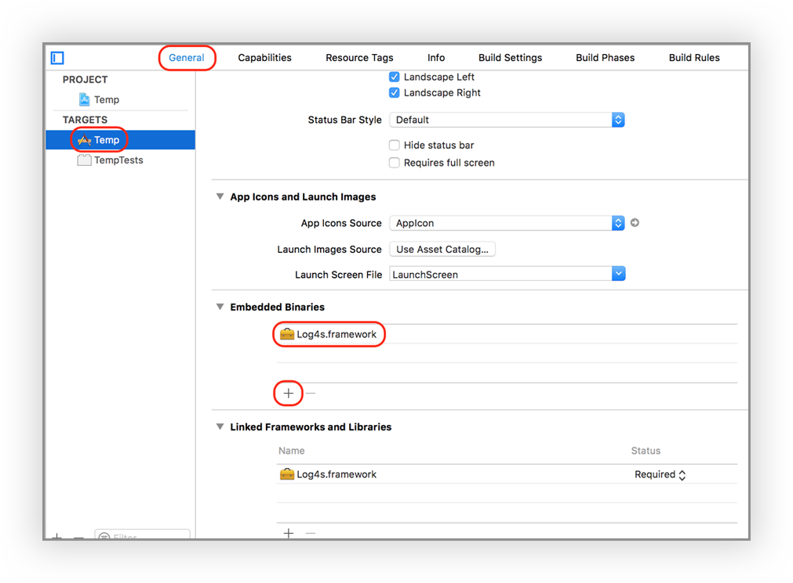

# Log4s

## 1. Feature List
Feature | Category |  Status | 
 --- | ---- | ----
Following [Swift API Design guideline](https://swift.org/documentation/api-design-guidelines/) | Syntax | --
Javascript-like [fluent interface](https://en.wikipedia.org/wiki/Fluent_interface) | Syntax | --
Multiple expandable destinations (a.k.a *Appender*s) | Appender |  DONE
Asynchronous logging support for *Appender*s | Appender | DONE
*Appender* for local persistent storage | Appender | UNDERGOING
Appender for other destinations | Appender | Coming
Built-in cascadable *Layout* components| Layout |DONE 
Asynchronous support for *Layout* | Layout| DONE
Multiple *tag*s support| Tags| DONE
*Appender* level tag filters | Tags |DONE
Directly log the type `Any` and `Error` | Misc | DONE
MaxSeverity for both *Logger* and *Appender* levels | Misc | DONE
Custom severity levels  | Misc | DONE
Message masking | Misc | Coming
Compatible with Cocoapod and Carthage |Misc | Coming

## 2. Quick Usage
### 2.1 Setup
**Universial Build**

* Download `Log4s.framework` latest release from [HERE]()
* Select your Target, then select the tab **General**, click **+** in the section of **Embeded Binaries**, then import `Log4s.framework` to your project, as shown in following snapshot.
* The universial build can be used for all arm and x64 architectures, which means you can use it for iOS device and iOS simulator. The support of OSX apps is undergoing.

### 2.2 Basic Usage

Start using the most basic function without any configuration or any unecessary parameters.

	import Log4s	// Put this line in the header of the files
	
	
	Logger.log("A Logging Message") // Most basic form
	Logger.log("A debug message", severity:.debug) // With severity mentioned
	
	//Below are some shortcuts for varies of built-in severities, with cascading expression
	
	Logger
       .verbose("This is a VERBOSE message")
       .debug("This is a DEBUG message")
       .info("This is an INFO message")
       .warn("This is a WARN message")
       .error("This is an ERROR message")
       .fatal("This is a FATAL message") 
	
## 3 Layouts

### 3.1 Quick Examples
To build the layout of logging messages. Here is a quick example:

	Logger.layout = [
       Layout.time(),	// the time when logging is called
       "{MyApp}",		// a pure string
       Layout.severity(),	// severity
       Layout.brackets().embed(			// a pair of brackets with embeded content
      		Layout.tags()			// the tags of the event, nested inside the brackets. See Chapter 4 for "Tags"  
       ),
       Layout.message()
       ]
       
	Logger.error("Failed to find profile",tags:["LoginScene","Network"])
The ouput is

> 17/01/05 14:05:48 {MyApp} ERROR [LoginScene|Network] Failed to find profile

With more configurations in the above example, it can be:

	Logger.layout = Layout.chain([
       Layout.time("HH:mm:ss"),	// assign the timestamp format
       "{MyApp}",
       Layout.severity(),
       Layout.brackets("<").embed([			// assign the brackets' type and embed another chain
       		"TAGS: ",
      		Layout.tags(dividedBy:",").uppercased()	// assign the delimiter of tags and use the uppercase
      		]
       ),
       Layout.message()
       ],dividedBy: "\t")	// insert "\t" between every two layout components
       
	Logger.error("Failed to find profile",tags:["LoginScene","Network"])
The ouput comes to be

	14:05:48	{MyApp}	ERROR	<TAGS: LoginScene|Network>	Failed to find profile
	
### 3.2 Layout Components

Name | Description | Example
--- | --- | --- 
 TBD| Find the usage of layout components in *SampleLogging.swift* in *SampleSwiftIOS* project|

### 3.3 Custom Layout
Override the function `func present(_ event: Event) -> String` to create customized `Layout`,  

	
	class MyLayout: Layout{
		override func present(_ event: Event) -> String {
			return "MyPrefix => [\(String(describing: event.sev))] \(event.message)"
		}
	}
	
	Logger.layout = MyLayout()
	Logger.error("This is an error message presented by 'MyLayout'")
	
The output

> MyPrefix => [ERROR] This is an error message presented by 'MyLayout'

Another quick way to implement custom layout is to use closure

	Logger.use(layout: Layout(){ (event) -> String in
            return "'MyLayout' [\(String(describing: event.sev))] \(event.message)"
        })
    Logger.error("The format of this message is defined by a closure")
The output

> 'MyLayout' [ERROR] The format of this message is defined by a closure
 
### 3.4 Asynchronous Layout

## 4. Tags and Filters
### 4.1 Multiple tags
### 4.2 

## 5. Appenders
### 5.1 
## 6. 

**Version**